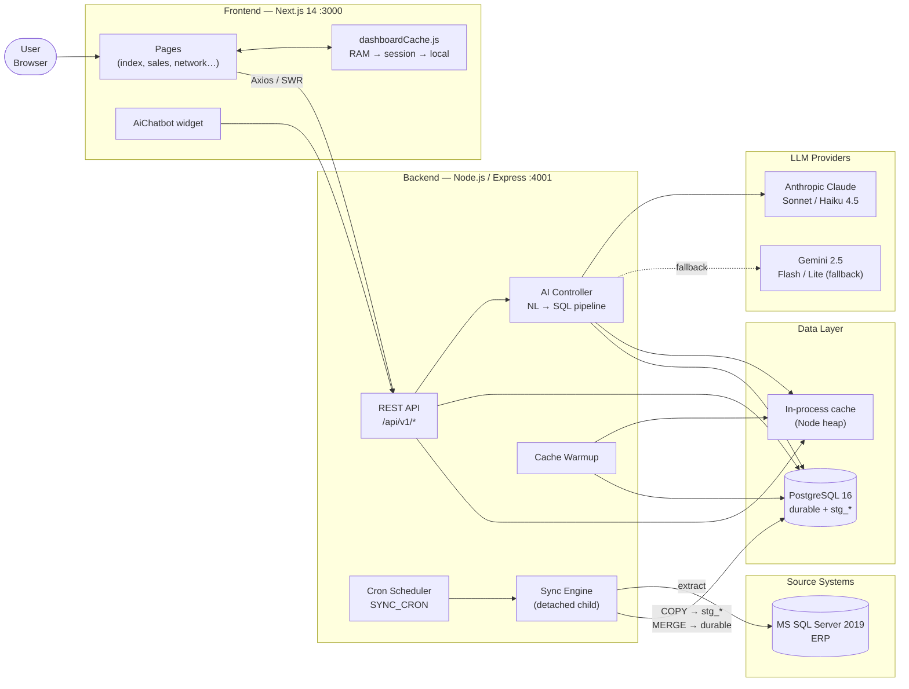
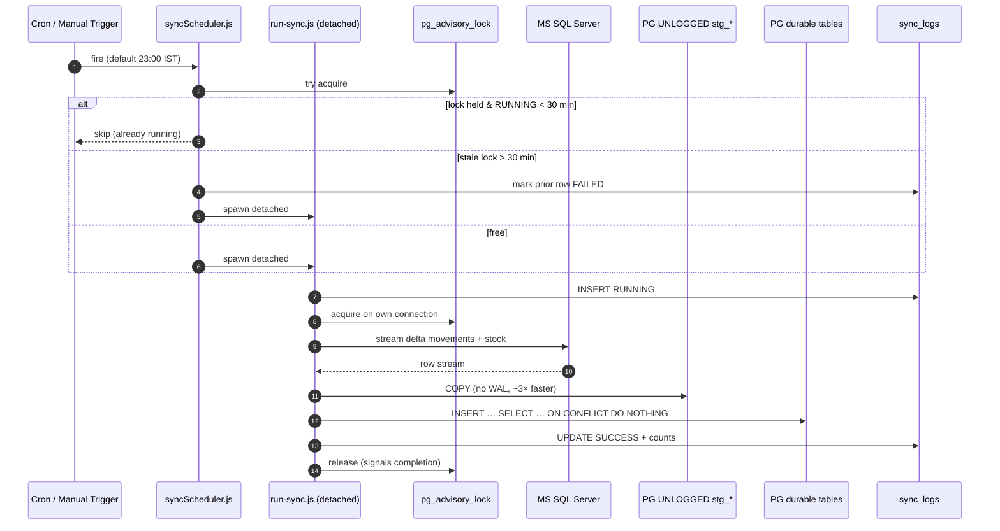
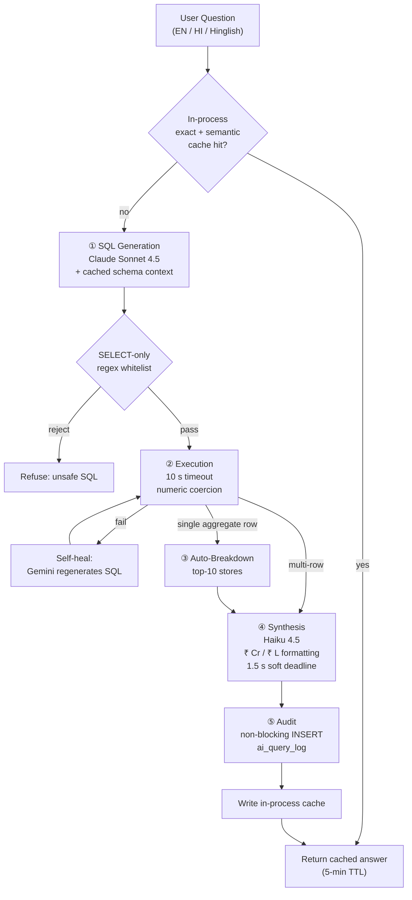
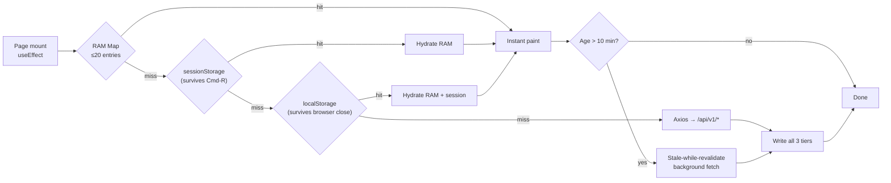
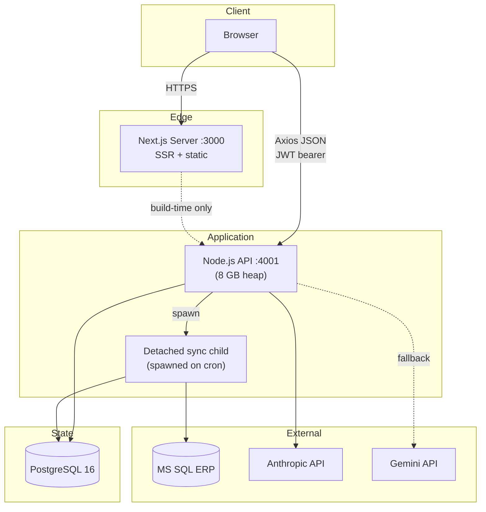

# Spykar IQ — Complete Project Context

> Enterprise AI-native inventory & sales intelligence platform for Spykar Jeans.
> Last updated: 2026-05-31

---

## 1. Executive Overview

**Spykar IQ** is a production-grade, full-stack analytics platform providing real-time visibility into stock, movements, and sales across the Spykar retail network — warehouses, distributors, COCO (company-owned), and FOFO (franchise-owned) stores.

The headline feature is an **AI-powered natural-language chatbot** (Claude Sonnet/Haiku 4.5 with Gemini 2.5 fallback) that converts business questions into safe PostgreSQL, executes them, auto-generates store-level breakdowns, and synthesizes a human-readable answer in English/Hindi/Hinglish with Indian currency formatting (₹ Cr / ₹ L).

**Architectural goals:**
- Single-roundtrip API calls via cache warm-up
- Multi-tier frontend cache (RAM → sessionStorage → localStorage) for instant paint on return visits
- AI prompt caching (~90% input-token reduction on schema context)
- Detached background ETL immune to parent-process restarts
- Streaming COPY into UNLOGGED staging tables for ~3× faster ETL

---

## 2. Repository Layout

```
spykar-project/
├── spykar-backend/          Node.js + Express REST API
├── spykar-frontend/         Next.js 14 dashboard
├── spykar-postman/          API collection
├── src/                     Legacy shared code
├── logs/                    Sync / app logs
├── README.md                25 KB architecture doc
└── LICENSE                  Proprietary
```

---

## 3. Backend — `spykar-backend/`

### 3.1 Stack
| Concern        | Choice                                          |
|----------------|-------------------------------------------------|
| Runtime        | Node.js 20.x (8 GB heap)                        |
| Framework      | Express 4.19.2                                  |
| Primary DB     | PostgreSQL 16                                   |
| Cache          | In-process (Node heap, `config/cache.js`)       |
| Source ERP     | Microsoft SQL Server 2019 (`mssql` 11.0.1)      |
| AI (primary)   | Anthropic Claude Sonnet/Haiku 4.5               |
| AI (fallback)  | Google Gemini 2.5 Flash / Flash-Lite            |
| Scheduling     | `node-cron` 3.0.3                               |
| Auth           | JWT (`jsonwebtoken` 9.0.2) + bcryptjs (cost 12) |
| Logging        | Winston 3.13.0                                  |

Entry point: `spykar-backend/src/server.js` → `app.js`.

### 3.2 Controllers (`src/controllers/`)
| File                            | Size  | Responsibility                                                                 |
|---------------------------------|-------|---------------------------------------------------------------------------------|
| `ai.controller.js`              | 71 KB | NL → SQL pipeline, prompt caching, session memory, self-healing SQL, semantic cache |
| `analytics.controller.js`       | 103 KB| Sales metrics, KPI rollups, cross-pivot                                         |
| `networkPulse.controller.js`    | 22 KB | Hero KPIs, dead capital, Pareto, aging buckets (0-30/31-60/61-90/91-180/180+)   |
| `inventory.controller.js`       | 39 KB | Stock snapshots, movements, reorder alerts                                      |
| `location.controller.js`        | 18 KB | Store master, zone health                                                       |
| `sku.controller.js`             | 11 KB | SKU master, search                                                              |
| `auth.controller.js`            | 10 KB | JWT login / refresh / logout                                                    |
| `distributor.controller.js`     | 10 KB | Distributor lookups                                                             |
| `sync.controller.js`            | 9 KB  | Manual ETL trigger, status polling, advisory-lock liveness                      |
| `dispatch.controller.js`        | 8 KB  | Dispatch / shipment data                                                        |
| `filters.controller.js`         | 8 KB  | Multi-select filter option lists                                                |

### 3.3 Services (`src/services/`)
- **`syncEngine.js`** (46 KB) — Detached child-process ETL. MS SQL → COPY → UNLOGGED staging → MERGE into durable tables. Advisory locks for liveness.
- **`cacheWarmup.js`** (23 KB) — Pre-populates the in-process cache (`config/cache.js`) with popular filter combinations and dashboard payloads.
- **`historicalStockLoader.js`** (16 KB) — Backfills stock history from `inventory_movements`.

### 3.4 Routes (prefix `/api/v1`)
`/auth`, `/ai`, `/analytics`, `/inventory`, `/locations`, `/sync`, `/skus`, `/dispatch`, `/filters`

### 3.5 Background Jobs
**`src/jobs/syncScheduler.js`** — Cron-driven (env `SYNC_CRON`, default `0 23 * * *` = 23:00 IST). Spawns detached `scripts/run-sync.js`. Concurrency guard via `pg_locks`; reaper marks any RUNNING row older than 30 min as FAILED.

**`src/jobs/cacheInvalidator.js`** — Polls `sync_logs` (env `CACHE_INVALIDATOR_INTERVAL_MS`, default 60 s). When it sees a newer `SUCCESS` than last observed, it flushes the in-process cache and re-warms the hot endpoints. This replaces Redis's old cross-process invalidation: the detached sync runs in a separate process and can't reach the API's in-memory cache, so the API self-refreshes from the DB signal instead.

---

## 4. Database — PostgreSQL 16

### 4.1 Migrations (`src/database/migrations/`)
| #   | File                                  | Purpose                                                                 |
|-----|---------------------------------------|-------------------------------------------------------------------------|
| 001 | `ai_query_log.sql`                    | AI chatbot audit trail                                                  |
| 002 | `spykar_erp_columns.sql`              | ERP fields (style_variant, width, length, …)                            |
| 003 | `group_name_cache.sql`                | Location grouping (EBO-SOR, …) + perf indexes                           |
| 004 | `sku_master_widths.sql`               | SKU dimension expansion                                                 |
| 005 | `performance_indexes.sql`             | Composite indexes on movements; trigram on colors/names                 |
| 006 | `alerts_performance.sql`              | Reorder-alert query optimization                                        |
| 007 | `world_class_foundation.sql`          | Foundation tables for advanced analytics                                |
| 008 | `filter_multi_select_perf.sql`        | Multi-value filter indexing                                             |
| 009 | `remove_user_zone.sql`                | Schema cleanup                                                          |
| 010 | `etl_staging_tables.sql`              | UNLOGGED `stg_stock` / `stg_movements` for COPY pipeline                |

### 4.2 Key Tables
- **`inventory_snapshot`** — current stock (qty_on_hand, qty_reserved, qty_in_transit, safety_stock)
- **`inventory_movements`** — every transaction (SALE / RETURN / RECEIPT / DISPATCH / TRANSFER / ADJUSTMENT). **Sales carry a negative `qty_change`.**
- **`skus`** — product master (sku_code, color_name, size, fit_type, mrp, style_variant, width, length)
- **`locations`** — store master (code, name, type ∈ {WAREHOUSE, DISTRIBUTOR, COCO, FOFO}, zone_id, city, state, group_name)
- **`dispatch_orders`** — inter-location shipments
- **`stock_ageing`** — aging buckets `qty_0_30 … qty_180_plus`
- **`ai_query_log`** — chatbot audit (user_id, question, generated_sql, row_count, answer)
- **`sync_logs`** — ETL history (status, row counts, timestamps)

---

## 5. Frontend — `spykar-frontend/`

### 5.1 Stack
| Concern    | Choice                                                 |
|------------|--------------------------------------------------------|
| Framework  | Next.js 14.2.5                                         |
| UI         | React 18.3.1, inline CSS-in-JS, Lucide React icons     |
| Charts     | ApexCharts 4.0 + Recharts 3.8                          |
| HTTP       | Axios 1.7.7 + SWR 2.2.5                                |
| Cache      | Custom `lib/dashboardCache.js` (3-tier)                |

### 5.2 Pages (`pages/`)
- `index.js` — v2 overview dashboard: KPI hero cards, India heatmap, aging waterfall, today-vs-LY pace, category mix, needs-attention panel.
- `sales.js` (95 KB) — Sales analytics, drilldown drawer, SKU performance, donut distributions, filter chips.
- `network.js` (89 KB) — Network Pulse: zone health, fill rates, COCO vs FOFO exception lists.
- `ai-query.js` — Chatbot interface.
- Plus `locations`, `users`, `sync`, `sku-analytics`, `movements`, `alerts`, `distributors`, `login`.

### 5.3 Key Components
- `AiChatbot.js` — Drag-to-resize chatbot with session memory.
- `dashboard-v2/` — TopBar, NarrativeBanner, KpiHeroCard, IndiaHeatmap, AgingWaterfall, NeedsAttentionPanel, FilterDrawer.
- `layout/` — Sidebar, Header.
- `sales/` — SalesPulse, SkuPerformance, DistributionDonuts, DrilldownDrawer.

### 5.4 `dashboardCache.js` — Three-Tier Cache
1. **RAM Map** — LRU, ≤20 entries, ~11 MB cap.
2. **sessionStorage** — survives Cmd-R, dies with tab.
3. **localStorage** — survives browser close (cross-day persistence).

Keys are namespaced (`sales:`, `net:pulse:`, `flt:opts:`) with a 10-min freshness window and stale-while-revalidate on mount. Returning users see an instant paint from localStorage while a background fetch refreshes data in <100 ms.

---

## 6. AI Chatbot — 5-Stage Pipeline (`ai.controller.js`)

1. **SQL Generation** — Claude Sonnet 4.5 with cached schema context → optimized PostgreSQL.
2. **Execution** — SELECT-only regex whitelist (blocks DDL/DML), 10 s timeout, numeric coercion.
3. **Auto-Breakdown** — If result is a single aggregate row, auto-generate a top-10 store breakdown.
4. **Synthesis** — Haiku 4.5 produces a 4–5 sentence answer with ₹ Cr / ₹ L formatting (soft 1.5 s deadline, graceful fallback).
5. **Audit** — Non-blocking INSERT into `ai_query_log`.

**Features:** festival-date intelligence (e.g. "5 days of Holi 2025" → Mar 10–14), relative dates ("last 30 days", "FY 2025"), self-healing SQL via Gemini on failure, 30-min session memory (1000-row cap), in-process exact + semantic caching (5-min TTL), multilingual answers.

---

## 7. ETL & Sync Engine

**Files:** `services/syncEngine.js`, `jobs/syncScheduler.js`, `scripts/run-sync.js`

**Schedule:** `SYNC_CRON` env (default `0 23 * * *` IST).

**Architecture:**
- Detached child process — immune to nodemon restarts and parent crashes. Lock release on the child's dedicated PG connection signals completion.
- Streaming + COPY into **UNLOGGED** `stg_stock` / `stg_movements` (no WAL, ~3× faster).
- Merge: `INSERT … SELECT … ON CONFLICT DO NOTHING` from staging to durable tables.
- Incremental delta on movements; full stock snapshot refresh nightly.
- Movement dedup via unique partial index `(location_id, sku_id, movement_type, reference_no, moved_at) WHERE reference_no IS NOT NULL`.

**Manual trigger:** `POST /api/v1/sync/trigger` → spawns `scripts/run-sync.js`, logs to `logs/sync-child.log`.

**Health:** Liveness reaper marks any RUNNING row >30 min old as FAILED; concurrency guard prevents overlapping manual + scheduled syncs.

---

## 8. Environment Configuration

### Backend `.env.example`
| Variable                    | Notes                                                   |
|-----------------------------|---------------------------------------------------------|
| `NODE_ENV`                  | development / production                                |
| `PORT`                      | default 4001                                            |
| `PG_*`                      | PostgreSQL creds, pool size 20, SSL toggle              |
| `JWT_SECRET`                | 64-byte hex (`openssl rand -hex 64`)                    |
| `JWT_EXPIRY`                | 15m access / 7d refresh                                 |
| `MSSQL_*`                   | ERP creds for delta sync                                |
| `SYNC_CRON`                 | default `0 23 * * *`                                    |
| `AI_PROVIDER`               | `gemini` or `anthropic`                                 |
| `GEMINI_API_KEY` / `_MODEL` | `gemini-2.5-flash` / `gemini-2.5-flash-lite`            |
| `ANTHROPIC_API_KEY`         | + `ANTHROPIC_SONNET_MODEL`, `ANTHROPIC_HAIKU_MODEL`     |

### Frontend `.env.local`
- `NEXT_PUBLIC_API_URL` — backend API base.

---

## 9. NPM Scripts

### Backend
| Script              | Action                                |
|---------------------|---------------------------------------|
| `npm start`         | Production, 8 GB heap                 |
| `npm run dev`       | Nodemon, 8 GB heap                    |
| `npm run dev:debug` | Inspector on :9229                    |
| `npm run db:migrate`| Run migrations                        |
| `npm run db:seed`   | Seed test data                        |
| `npm run sync:manual` | One-off delta sync                  |
| `npm run sync:full` | Full stock snapshot refresh           |
| `npm run ageing:update` | Recalc aging buckets              |
| `npm test`          | Jest + coverage                       |

### Frontend
| Script              | Action                                |
|---------------------|---------------------------------------|
| `npm run dev`       | Dev server :3000                      |
| `npm run dev:fresh` | Wipe `.next`, then dev                |
| `npm run build`     | Production build                      |
| `npm start`         | Production server                     |

---

## 10. Security & Rate Limits

| Layer            | Limit / Policy                                       |
|------------------|------------------------------------------------------|
| Global API       | 500 req / 15 min / IP                                |
| Auth             | 30 login attempts / 15 min / IP                      |
| AI chatbot       | 200 queries / min / user (also 60/min on `/ai`)      |
| JWT              | 15-min access, 7-day refresh                         |
| Passwords        | bcryptjs cost 12                                     |
| CORS             | Explicit origin whitelist (dev allows `localhost:*`) |
| AI SQL safety    | SELECT-only regex; blocks INSERT/UPDATE/DELETE/DROP  |
| AI output        | Sanitized before DB execution                        |

---

## 11. Architecture Diagrams

### 11.1 System Overview — End-to-End Flow



### 11.2 ETL Sync Engine — Detached Child Process



### 11.3 AI Chatbot — 5-Stage Pipeline



### 11.4 Frontend Three-Tier Cache



### 11.5 Deployment Topology



---

## 12. API Endpoints Reference

All routes mount under `/api/v1` (from `src/app.js`). Auth uses JWT bearer tokens.
Role hierarchy: `SUPER_ADMIN > ADMIN > MANAGER > VIEWER`.

**Global middleware:** 45 s request timeout · Helmet · CORS (whitelist) · `express-validator` on body/query/params.

**Rate limits:**
- Global — 500 req / 15 min / IP
- Auth — 30 req / 15 min / IP
- AI — 200 req / min / user (also 60/min on `/ai`)

### 12.1 System

| Method | Path           | Auth | Purpose                              |
|--------|----------------|------|--------------------------------------|
| GET    | `/health`      | —    | Liveness + version/environment       |
| GET    | `/health/deep` | —    | Deep check (PostgreSQL + in-process cache) |

### 12.2 Auth & Users (`auth.routes.js`)

| Method | Path                              | Auth | Purpose                                                       |
|--------|-----------------------------------|------|---------------------------------------------------------------|
| POST   | `/api/v1/auth/login`              | —    | Email/password login → access + refresh JWT                   |
| POST   | `/api/v1/auth/refresh`            | —    | Exchange refresh token for new access token                   |
| POST   | `/api/v1/auth/logout`             | JWT  | Invalidate token                                              |
| GET    | `/api/v1/auth/me`                 | JWT  | Current user profile                                          |
| PATCH  | `/api/v1/auth/password`           | JWT  | Change password (≥8 chars, uppercase + digit)                 |
| GET    | `/api/v1/users`                   | JWT  | List users — `SUPER_ADMIN`, `ADMIN`                           |
| POST   | `/api/v1/users`                   | JWT  | Create user — `SUPER_ADMIN`, `ADMIN`                          |
| PATCH  | `/api/v1/users/:id`               | JWT  | Update user — `SUPER_ADMIN`, `ADMIN`                          |
| PATCH  | `/api/v1/users/:id/toggle`        | JWT  | Toggle active — `SUPER_ADMIN`                                 |

### 12.3 AI Chatbot (`ai.routes.js`)

| Method | Path                                | Auth | Purpose                                              |
|--------|-------------------------------------|------|------------------------------------------------------|
| POST   | `/api/v1/ai/query`                  | JWT  | NL → SQL → answer pipeline (5–500 char question)     |
| GET    | `/api/v1/ai/history`                | JWT  | Current user's query history                         |
| GET    | `/api/v1/ai/suggested-queries`      | JWT  | Pre-built useful prompts                             |

### 12.4 Analytics (`analytics.routes.js`)

| Method | Path                                              | Auth | Purpose                                                  |
|--------|---------------------------------------------------|------|----------------------------------------------------------|
| GET    | `/api/v1/analytics/network-overview`              | JWT  | Overall network KPIs                                     |
| GET    | `/api/v1/analytics/stock-trend`                   | JWT  | Stock trend over 7–365 days                              |
| GET    | `/api/v1/analytics/size-distribution`             | JWT  | Size distribution by location type                       |
| GET    | `/api/v1/analytics/color-distribution`            | JWT  | Color distribution by location type                      |
| GET    | `/api/v1/analytics/zone-heatmap`                  | JWT  | Zone-level sales heatmap                                 |
| GET    | `/api/v1/analytics/fill-rate`                     | JWT  | Fill-rate analytics (7–90 days)                          |
| GET    | `/api/v1/analytics/sales`                         | JWT  | Full sales analytics with pivots                         |
| GET    | `/api/v1/analytics/sales/summary`                 | JWT  | Slim sales payload (summary + daily + channels)          |
| GET    | `/api/v1/analytics/sales/drilldown`               | JWT  | Sales drilldown by store or SKU                          |
| GET    | `/api/v1/analytics/returns`                       | JWT  | Returns analytics                                        |
| GET    | `/api/v1/analytics/overview/cross-pivot`          | JWT  | Sales + inventory cross-pivot (Overview page)            |
| GET    | `/api/v1/analytics/state-heatmap`                 | JWT  | State-level sales for India map                          |

### 12.5 Inventory (`inventory.routes.js`)

| Method | Path                                              | Auth | Purpose                                              |
|--------|---------------------------------------------------|------|------------------------------------------------------|
| GET    | `/api/v1/inventory/executive-summary`             | JWT  | Top-level KPIs across the network                    |
| GET    | `/api/v1/inventory/snapshot`                      | JWT  | Full inventory + filters + pagination                |
| GET    | `/api/v1/inventory/snapshot/export`               | JWT  | Export inventory to CSV                              |
| GET    | `/api/v1/inventory/location/:locationId`          | JWT  | Inventory at a specific location                     |
| GET    | `/api/v1/inventory/sku/:skuId`                    | JWT  | Inventory of one SKU across all locations            |
| GET    | `/api/v1/inventory/alerts/summary`                | JWT  | Counts (low stock + critical)                        |
| GET    | `/api/v1/inventory/alerts`                        | JWT  | Low-stock + critical alert list                      |
| GET    | `/api/v1/inventory/movements`                     | JWT  | Movement ledger + filters                            |
| GET    | `/api/v1/inventory/ageing`                        | JWT  | Stock ageing report                                  |
| POST   | `/api/v1/inventory/adjust`                        | JWT  | Manual adjustment — `SUPER_ADMIN`, `ADMIN`           |

### 12.6 Locations (`location.routes.js`)

| Method | Path                                       | Auth | Purpose                                                      |
|--------|--------------------------------------------|------|--------------------------------------------------------------|
| GET    | `/api/v1/locations/zones`                  | JWT  | List zones                                                   |
| GET    | `/api/v1/locations/network-pulse`          | JWT  | Hero KPIs, dead capital, top stores, Pareto, ageing          |
| GET    | `/api/v1/locations`                        | JWT  | List locations + filters + pagination                        |
| GET    | `/api/v1/locations/:id`                    | JWT  | Location details                                             |
| GET    | `/api/v1/locations/:id/summary`            | JWT  | Location summary                                             |
| POST   | `/api/v1/locations`                        | JWT  | Create — `SUPER_ADMIN`, `ADMIN`                              |
| PATCH  | `/api/v1/locations/:id`                    | JWT  | Update — `SUPER_ADMIN`, `ADMIN`                              |

### 12.7 SKUs (`sku.routes.js`)

| Method | Path                                              | Auth | Purpose                                              |
|--------|---------------------------------------------------|------|------------------------------------------------------|
| GET    | `/api/v1/skus`                                    | JWT  | List SKUs + filters + pagination                     |
| GET    | `/api/v1/skus/matrix`                             | JWT  | Size × Color stock-matrix heatmap data               |
| GET    | `/api/v1/skus/sizes`                              | JWT  | All sizes with total stock                           |
| GET    | `/api/v1/skus/colors`                             | JWT  | All colors with total stock                          |
| GET    | `/api/v1/skus/top-moving`                         | JWT  | Top-N fastest-moving SKUs                            |
| GET    | `/api/v1/skus/slow-moving`                        | JWT  | Dead / slow stock (30–365 day window)                |
| GET    | `/api/v1/skus/:id`                                | JWT  | SKU details                                          |
| GET    | `/api/v1/skus/:id/inventory-by-location`          | JWT  | SKU inventory broken down by location                |

### 12.8 Dispatch (`dispatch.routes.js`)

| Method | Path                                       | Auth | Purpose                                                      |
|--------|--------------------------------------------|------|--------------------------------------------------------------|
| GET    | `/api/v1/dispatch`                         | JWT  | List dispatch orders + filters                               |
| GET    | `/api/v1/dispatch/in-transit`              | JWT  | In-transit shipments                                         |
| GET    | `/api/v1/dispatch/summary`                 | JWT  | Dispatch summary                                             |
| GET    | `/api/v1/dispatch/couriers`                | JWT  | Available couriers                                           |
| GET    | `/api/v1/dispatch/:id`                     | JWT  | Dispatch order details                                       |
| GET    | `/api/v1/dispatch/:id/line-items`          | JWT  | Dispatch line items                                          |
| POST   | `/api/v1/dispatch`                         | JWT  | Create — `SUPER_ADMIN`, `ADMIN`, `MANAGER`                   |
| PATCH  | `/api/v1/dispatch/:id/status`              | JWT  | Update status — `SUPER_ADMIN`, `ADMIN`, `MANAGER`            |

### 12.9 Distributors (`distributor.routes.js`)

| Method | Path                                              | Auth | Purpose                                              |
|--------|---------------------------------------------------|------|------------------------------------------------------|
| GET    | `/api/v1/distributors`                            | JWT  | List + filters + pagination                          |
| GET    | `/api/v1/distributors/top`                        | JWT  | Top-N distributors by metric                         |
| GET    | `/api/v1/distributors/comparison`                 | JWT  | Side-by-side comparison                              |
| GET    | `/api/v1/distributors/:id`                        | JWT  | Distributor details                                  |
| GET    | `/api/v1/distributors/:id/inventory`              | JWT  | Distributor inventory + filters                      |
| GET    | `/api/v1/distributors/:id/movements`              | JWT  | Distributor stock movements                          |
| GET    | `/api/v1/distributors/:id/ageing`                 | JWT  | Distributor stock ageing                             |

### 12.10 Filters (`filters.routes.js`)

| Method | Path                                       | Auth | Purpose                                              |
|--------|--------------------------------------------|------|------------------------------------------------------|
| GET    | `/api/v1/filters/options`                  | JWT  | Bulk fetch of all filter dimensions                  |
| GET    | `/api/v1/filters/options/:dimension`       | JWT  | Per-dimension fetch of filter options                |

### 12.11 Sync (`sync.routes.js`)

| Method | Path                              | Auth | Purpose                                                       |
|--------|-----------------------------------|------|---------------------------------------------------------------|
| GET    | `/api/v1/sync/status`             | JWT  | Sync status — `SUPER_ADMIN`, `ADMIN`                          |
| GET    | `/api/v1/sync/logs`               | JWT  | Sync logs — `SUPER_ADMIN`, `ADMIN`                            |
| POST   | `/api/v1/sync/trigger`            | JWT  | Manually spawn detached sync — `SUPER_ADMIN`, `ADMIN`         |

### 12.12 Conventions

- **Auth header:** `Authorization: Bearer <access_token>` (15 min lifetime; refresh with `/auth/refresh`).
- **Pagination:** `?page=<n>&pageSize=<n>` (default 1 / 50). Responses include `{ items, total, page, pageSize }`.
- **Filters:** Multi-value via repeated query params (`?zone=N&zone=S`) or comma-joined.
- **Errors:** JSON `{ error: { code, message, details? } }` with appropriate 4xx/5xx status.
- **CSV exports:** `Content-Type: text/csv` + `Content-Disposition: attachment`.

---

## 13. Database Schema Reference

PostgreSQL 16. Extensions: `uuid-ossp`, `pg_trgm`. All `updated_at` columns are
maintained by a shared `update_updated_at()` trigger.

### 13.1 ENUM Types

| Type              | Values                                                                 |
|-------------------|------------------------------------------------------------------------|
| `location_type`   | `WAREHOUSE`, `DISTRIBUTOR`, `COCO`, `FOFO`, `TRANSIT`                  |
| `dispatch_status` | `PENDING`, `DISPATCHED`, `IN_TRANSIT`, `DELIVERED`, `CANCELLED`, `PARTIAL` |
| `user_role`       | `SUPER_ADMIN`, `ADMIN`, `MANAGER`, `VIEWER`                            |
| `sync_status`     | `PENDING`, `RUNNING`, `SUCCESS`, `FAILED`                              |
| `movement_type`   | `SALE`, `DISPATCH`, `RECEIPT`, `RETURN`, `TRANSFER_OUT`, `TRANSFER_IN`, `ADJUSTMENT` |

### 13.2 Master Tables

#### `users` — authentication & access control
| Column           | Type          | Notes                              |
|------------------|---------------|------------------------------------|
| `id`             | UUID PK       | `uuid_generate_v4()`               |
| `name`           | VARCHAR(100)  | NOT NULL                           |
| `email`          | VARCHAR(150)  | UNIQUE, NOT NULL                   |
| `password_hash`  | VARCHAR(255)  | NOT NULL (bcrypt cost 12)          |
| `phone`          | VARCHAR(15)   |                                    |
| `role`           | `user_role`   | DEFAULT `VIEWER`                   |
| `location_id`    | UUID          | FK → `locations.id`                |
| `is_active`      | BOOLEAN       | DEFAULT true                       |
| `last_login_at`  | TIMESTAMPTZ   |                                    |
| `created_at` / `updated_at` | TIMESTAMPTZ | DEFAULT NOW()              |

Indexes: `idx_users_email(email)`.

#### `refresh_tokens` — JWT rotation
| Column | Type | Notes |
|--------|------|-------|
| `id`           | UUID PK     |                                    |
| `user_id`      | UUID        | FK → `users.id` ON DELETE CASCADE  |
| `token_hash`   | VARCHAR(255)| NOT NULL                           |
| `expires_at`   | TIMESTAMPTZ | NOT NULL                           |
| `created_at`   | TIMESTAMPTZ | DEFAULT NOW()                      |

Indexes: `idx_refresh_tokens_user(user_id)`, `idx_refresh_tokens_hash(token_hash)`.

#### `zones` — geographic regions
| Column | Type | Notes |
|--------|------|-------|
| `id`     | SERIAL PK    |                  |
| `code`   | VARCHAR(20)  | UNIQUE, NOT NULL |
| `name`   | VARCHAR(100) | NOT NULL         |
| `is_active` | BOOLEAN   | DEFAULT true     |

#### `locations` — warehouses, distributors, COCO, FOFO
| Column           | Type            | Notes                          |
|------------------|-----------------|--------------------------------|
| `id`             | UUID PK         |                                |
| `code`           | VARCHAR(50)     | UNIQUE, NOT NULL               |
| `name`           | VARCHAR(200)    | NOT NULL                       |
| `type`           | `location_type` | NOT NULL                       |
| `zone_id`        | INTEGER         | FK → `zones.id`                |
| `city`, `state`, `pincode`, `address` | …    |                          |
| `gstin`          | VARCHAR(20)     |                                |
| `contact_*`      | VARCHAR         | name / phone / email           |
| `group_name`     | VARCHAR(100)    | EBO-SOR / SIS / MBO …          |
| `credit_limit`   | NUMERIC(15,2)   | DEFAULT 0                      |
| `shop_closed`    | BOOLEAN         | DEFAULT false                  |
| `closed_on`      | DATE            |                                |
| `is_active`      | BOOLEAN         | DEFAULT true                   |
| `external_id`    | VARCHAR(100)    | ERP linkage                    |

Key indexes: `type`, `zone`, `code`, `external_id`, `group_name` (partial),
`type+city` / `state+city` / `state` / `city` (all partial on `is_active`),
GIN trigram on `name`, `shop_closed+is_active`, plus upper-case functional
indexes for case-insensitive lookups (`UPPER(state)`, `UPPER(city)`,
`UPPER(group_name)`, `UPPER(code)`).

#### `skus` — Product × Color × Size matrix
| Column           | Type           | Notes                          |
|------------------|----------------|--------------------------------|
| `id`             | UUID PK        |                                |
| `sku_code`       | VARCHAR(100)   | UNIQUE, NOT NULL               |
| `product_name`   | VARCHAR(200)   | NOT NULL                       |
| `category`       | VARCHAR(100)   | DEFAULT `'Jeans'`              |
| `sub_category`   | VARCHAR(100)   |                                |
| `color_code` / `color_name` | VARCHAR | NOT NULL                  |
| `size`           | VARCHAR(30)    | NOT NULL                       |
| `fit_type`, `fabric`, `gender`, `season` | … |                       |
| `mrp`            | NUMERIC(10,2)  | NOT NULL                       |
| `cost_price`     | NUMERIC(10,2)  |                                |
| `barcode`, `hsn_code`, `gst_rate`        | …                          |
| `style_code`, `style_variant`, `style`, `shade` | …                   |
| `sub_product`, `product`, `category_norm`       | normalized fields   |
| `hit_name`, `gender_name`, `fit_name`           | display fields       |
| `infor_item_code`, `infor_style`                | ERP linkage          |
| `brand`          | VARCHAR(50)    |                                |
| `is_active`      | BOOLEAN        | DEFAULT true                   |
| `external_id`    | VARCHAR(100)   |                                |

Key indexes: `sku_code`, `color_code`, `size`, `external_id`,
GIN trigram on `product_name` + `color_name`,
partial on `style_variant`, `style`, `shade`, `sub_product`, `season`,
`category_norm`, `gender_name`,
composite drill `(gender_name, sub_product, style)`,
plus ~10 `UPPER(...)` functional indexes for case-insensitive filtering.

### 13.3 Inventory Tables

#### `inventory_snapshot` — live current stock
| Column            | Type        | Notes                                        |
|-------------------|-------------|----------------------------------------------|
| `id`              | UUID PK     |                                              |
| `location_id`     | UUID        | FK → `locations.id`                          |
| `sku_id`          | UUID        | FK → `skus.id`                               |
| `qty_on_hand`     | INTEGER     | DEFAULT 0                                    |
| `qty_reserved`    | INTEGER     | DEFAULT 0                                    |
| `qty_in_transit`  | INTEGER     | DEFAULT 0                                    |
| `qty_available`   | INTEGER     | GENERATED `qty_on_hand - qty_reserved` STORED |
| `safety_stock`    | INTEGER     | DEFAULT 0                                    |
| `reorder_point`   | INTEGER     | DEFAULT 0                                    |
| `last_movement_at`| TIMESTAMPTZ |                                              |
| `snapshot_date`   | DATE        | DEFAULT CURRENT_DATE                         |

Constraint: `UNIQUE (location_id, sku_id)`.
Indexes: `location_id`, `sku_id`, `snapshot_date`, `qty_on_hand`,
partial `qty_on_hand WHERE qty_on_hand <= safety_stock` (low-stock alerts),
covering `(location_id) INCLUDE (qty_on_hand, qty_available, qty_in_transit)`,
composite `(location_id, sku_id)`, `(qty_on_hand, safety_stock)`.

#### `inventory_movements` — full transaction ledger
| Column           | Type            | Notes                                   |
|------------------|-----------------|-----------------------------------------|
| `id`             | UUID PK         |                                         |
| `location_id`    | UUID            | FK                                      |
| `sku_id`         | UUID            | FK                                      |
| `movement_type`  | `movement_type` | NOT NULL                                |
| `qty_change`     | INTEGER         | **Sales carry negative `qty_change`**   |
| `qty_before`/`qty_after` | INTEGER |                                         |
| `reference_id` / `reference_type` / `reference_no` | UUID / VARCHAR | source doc |
| `sale_value`     | DECIMAL(12,2)   | for SALE/RETURN rows                    |
| `notes`          | TEXT            |                                         |
| `moved_at`       | TIMESTAMPTZ     | DEFAULT NOW()                           |
| `synced_from`    | VARCHAR(50)     | ETL source tag                          |

Indexes: `location_id`, `sku_id`, `movement_type`, `moved_at DESC`,
`reference_id`, composites `(movement_type, moved_at DESC)`,
`(sku_id, movement_type, moved_at DESC)`,
`(location_id, movement_type, moved_at DESC)`,
partial `(movement_type, moved_at DESC, location_id, sku_id) WHERE movement_type='SALE'`,
**UNIQUE partial** `uq_movements_reference(location_id, sku_id, movement_type, reference_no, moved_at) WHERE reference_no IS NOT NULL` (ETL dedup).

#### `stock_ageing` — age-cohort buckets
| Column          | Type    | Notes              |
|-----------------|---------|--------------------|
| `id`            | UUID PK |                    |
| `location_id`   | UUID    | FK                 |
| `sku_id`        | UUID    | FK                 |
| `qty_0_30`      | INTEGER | DEFAULT 0          |
| `qty_31_60`     | INTEGER | DEFAULT 0          |
| `qty_61_90`     | INTEGER | DEFAULT 0          |
| `qty_91_180`    | INTEGER | DEFAULT 0          |
| `qty_180_plus`  | INTEGER | DEFAULT 0          |
| `ageing_date`   | DATE    | DEFAULT CURRENT_DATE |

Constraint: `UNIQUE (location_id, sku_id, ageing_date)`.
Indexes: `location_id`, `sku_id`, `ageing_date DESC`,
partial `qty_180_plus WHERE qty_180_plus > 0` (dead-stock).

#### `inventory_daily_snapshot` — **range-partitioned** by month
Source: `EXEC AIGetStock 'DD-mon-YY'`. Partition range covers Jan 2024 – Feb 2026 (`inventory_daily_snapshot_YYYY_MM`).

| Column          | Type        | Notes                          |
|-----------------|-------------|--------------------------------|
| `snapshot_date` | DATE        | partition key, part of PK      |
| `location_id`   | UUID        | part of PK                     |
| `sku_id`        | UUID        | part of PK                     |
| `qty_on_hand`   | INTEGER     | DEFAULT 0                      |
| `source`        | VARCHAR(20) | DEFAULT `'AIGetStock'`         |
| `loaded_at`     | TIMESTAMPTZ | DEFAULT NOW()                  |

Indexes: `(snapshot_date, location_id)`, `(location_id, sku_id, snapshot_date DESC)`, `(sku_id, snapshot_date)`.

#### `stock_history_load_log` — resumable backfill checkpoints
| Column           | Type        | Notes                                          |
|------------------|-------------|------------------------------------------------|
| `snapshot_date`  | DATE PK     |                                                |
| `status`         | VARCHAR(20) | `PENDING` / `RUNNING` / `SUCCESS` / `FAILED`   |
| `erp_rows`, `resolved_rows`, `lookup_misses`, `duration_ms` | …  |             |
| `error_message`  | TEXT        |                                                |
| `attempted_at` / `completed_at` | TIMESTAMPTZ |                                  |

Index: `(status, snapshot_date)`.

### 13.4 Dispatch Tables

#### `dispatch_orders`
| Column           | Type              | Notes                          |
|------------------|-------------------|--------------------------------|
| `id`             | UUID PK           |                                |
| `dispatch_no`    | VARCHAR(50)       | UNIQUE, NOT NULL               |
| `from_location_id` / `to_location_id` | UUID | FK → `locations.id`     |
| `status`         | `dispatch_status` | DEFAULT `PENDING`              |
| `total_skus` / `total_qty` | INTEGER | DEFAULT 0                  |
| `total_value`    | NUMERIC(15,2)     | DEFAULT 0                      |
| `dispatched_at` / `expected_at` / `delivered_at` | TIMESTAMPTZ |          |
| `courier_name` / `tracking_no` | VARCHAR(100) |                          |
| `notes`          | TEXT              |                                |
| `external_id`    | VARCHAR(100)      |                                |
| `created_by`     | UUID              | FK → `users.id`                |

Indexes: `from_location_id`, `to_location_id`, `status`, `dispatched_at DESC`,
`external_id`, composite `(status, dispatched_at DESC)`.

#### `dispatch_line_items`
| Column           | Type        | Notes                                    |
|------------------|-------------|------------------------------------------|
| `id`             | UUID PK     |                                          |
| `dispatch_id`    | UUID        | FK → `dispatch_orders.id` ON DELETE CASCADE |
| `sku_id`         | UUID        | FK → `skus.id`                           |
| `qty_ordered`    | INTEGER     | NOT NULL                                 |
| `qty_dispatched` / `qty_received` | INTEGER | DEFAULT 0                       |
| `unit_cost`      | NUMERIC(10,2) |                                        |

Indexes: `dispatch_id`, `sku_id`.

### 13.5 Sync & ETL Tables

#### `sync_logs` — durable ETL run history
| Column                 | Type          | Notes                                    |
|------------------------|---------------|------------------------------------------|
| `id`                   | UUID PK       |                                          |
| `sync_type`            | VARCHAR(50)   | `FULL` / `DELTA` / `MANUAL`              |
| `status`               | `sync_status` | DEFAULT `PENDING`                        |
| `source`               | VARCHAR(50)   | DEFAULT `SQL_SERVER`                     |
| `records_fetched` / `_inserted` / `_updated` / `_failed` | INTEGER |   |
| `error_message`        | TEXT          |                                          |
| `started_at` / `completed_at` / `duration_ms` | …       |                   |

Indexes: `status`, `started_at DESC`.

#### `stg_stock` — **UNLOGGED** staging (no WAL)
| Column        | Type    |
|---------------|---------|
| `location_id` | UUID    |
| `sku_id`      | UUID    |
| `qty`         | INTEGER |

No PK / no indexes. Truncated at sync start, COPY-loaded from MS SQL stream,
aggregated by `(location_id, sku_id)` during merge into `inventory_snapshot`.

#### `stg_movements` — **UNLOGGED** staging
| Column          | Type          |
|-----------------|---------------|
| `location_id`   | UUID          |
| `sku_id`        | UUID          |
| `movement_type` | VARCHAR(20)   |
| `qty_change`    | INTEGER       |
| `reference_no`  | TEXT          |
| `sale_value`    | NUMERIC(15,2) |
| `moved_at`      | TIMESTAMPTZ   |

No PK / no indexes. Merged into `inventory_movements` via
`INSERT … SELECT … ON CONFLICT DO NOTHING` against `uq_movements_reference`.

### 13.6 AI Audit

#### `ai_query_log` — chatbot audit trail
Captures `user_id`, original question, generated SQL, row count, final answer,
timing. Written non-blocking at end of the 5-stage AI pipeline.

### 13.7 Views

| View                  | Purpose                                                              |
|-----------------------|----------------------------------------------------------------------|
| `v_inventory_full`    | `inventory_snapshot ⋈ locations ⋈ zones ⋈ skus` with `is_below_safety` flag (active rows only) |
| `v_executive_summary` | Grouped by `location_type`: counts, active SKUs, totals, stock value, low-stock alerts |
| `v_top_distributors`  | Distributors ranked by `total_stock DESC` (active only)              |

### 13.8 Functions & Triggers

- **`update_updated_at()`** — `BEFORE UPDATE` trigger function bumping `updated_at`. Applied as `trg_users_updated`, `trg_locations_updated`, `trg_skus_updated`, `trg_inventory_updated`, `trg_dispatch_updated`.

### 13.9 Schema Conventions

- **UUID primary keys** everywhere except `zones` (SERIAL) and partitioned `inventory_daily_snapshot` (composite PK).
- **TIMESTAMPTZ** for all timestamps — stored UTC, rendered IST on the frontend.
- **External IDs** (`external_id`, `infor_item_code`, `infor_style`) preserve ERP linkage without leaking ERP keys into application code.
- **Soft delete** via `is_active = false` — most filter indexes are partial on `is_active = true`.
- **Case-insensitive search** via `UPPER(...)` functional indexes; full-text style search via `pg_trgm` GIN indexes.
- **Sales sign convention:** `inventory_movements.qty_change` is negative for `SALE`, positive for `RETURN` / `RECEIPT`.

---

## 14. Deployment & Setup

### 14.1 Prerequisites

| Component        | Version              | Notes                                       |
|------------------|----------------------|---------------------------------------------|
| Node.js          | ≥ 20.x (LTS)         | `engines.node >=18.0.0` in both packages    |
| PostgreSQL       | 16.x (local or managed) | Extensions: `uuid-ossp`, `pg_trgm`       |
| MS SQL Server    | 2019                 | Source ERP — read access only               |
| AI key           | Gemini *or* Anthropic | At least one required                      |

No Redis or Docker needed — caching is in-process (`config/cache.js`) and PostgreSQL can be any local or managed instance.

### 14.2 First-Time Local Setup

```bash
# 1. Clone
git clone https://github.com/Ambujkumar909/spykar-inventory.git
cd spykar-inventory

# 2. Backend
cd spykar-backend
npm install
cp .env.example .env          # then edit — see §14.6
npm run db:migrate            # creates schema + runs migrations 001–010
npm run db:seed               # 3 starter users (see §14.7)
npm run dev                   # http://localhost:4001

# 3. Frontend (new terminal)
cd ../spykar-frontend
npm install
echo "NEXT_PUBLIC_API_URL=http://127.0.0.1:4001/api/v1" > .env.local
npm run dev                   # http://localhost:3000
```

### 14.3 One-Click Startup (Windows)

From the project root, run **`start.bat`** — it checks Node, installs
dependencies on first run, launches the backend and frontend in separate
windows, and opens the dashboard. **`stop.bat`** stops both (kills whatever is
listening on ports 4000 / 3000). The backend connects to the PostgreSQL defined
in `spykar-backend/.env`; no Redis or Docker is involved.

For production, run the processes directly (`npm start` for the backend,
`npm run build && npm start` for the frontend) behind a reverse proxy, under a
process manager such as PM2 or systemd.

### 14.5 NPM Scripts (deployment-relevant)

**Backend:**
```bash
npm start              # node --max-old-space-size=8192 src/server.js
npm run dev            # nodemon (8 GB heap)
npm run db:migrate     # node src/database/migrate.js
npm run db:seed        # node src/database/seed.js
npm run sync:manual    # one-off delta sync via syncEngine
npm run sync:full      # node src/scripts/run_full_sync.js
npm run ageing:update  # node src/scripts/run_ageing_update.js
npm test               # jest --coverage
```

**Frontend:**
```bash
npm run dev            # next dev -p 3000
npm run dev:fresh      # wipe .next, then dev
npm run build          # next build
npm start              # next start
```

### 14.6 Environment Variables — Backend `.env`

| Variable                  | Example / Default                   | Purpose                                   |
|---------------------------|-------------------------------------|-------------------------------------------|
| `NODE_ENV`                | `development` / `production`        |                                           |
| `PORT`                    | `4001`                              | API bind port                             |
| `HOST`                    | `0.0.0.0`                           |                                           |
| `LOG_LEVEL`               | `info`                              | Winston level                             |
| `ALLOWED_ORIGINS`         | `http://localhost:3000`             | CORS whitelist (comma-sep)                |
| `PG_HOST` / `PG_PORT` / `PG_DATABASE` / `PG_USER` / `PG_PASSWORD` | … | PostgreSQL creds      |
| `PG_POOL_MAX`             | `20`                                |                                           |
| `PG_SSL`                  | `false` (prod: `true`)              |                                           |
| `CACHE_INVALIDATOR_INTERVAL_MS` | `60000`                       | How often to poll `sync_logs` for cache flush |
| `JWT_SECRET`              | 64-byte hex (`openssl rand -hex 64`)| **Rotate per environment**                |
| `JWT_EXPIRY`              | `15m`                               | Access-token lifetime                     |
| `JWT_REFRESH_EXPIRY`      | `7d`                                |                                           |
| `MSSQL_HOST` / `_PORT` / `_DATABASE` / `_USER` / `_PASSWORD` | … | ERP source           |
| `MSSQL_ENCRYPT`           | `false`                             |                                           |
| `ENABLE_SCHEDULER`        | `true`                              | Set `false` on non-leader nodes           |
| `SYNC_CRON`               | `0 23 * * *`                        | 23:00 IST nightly                         |
| `AI_PROVIDER`             | `gemini` *or* `anthropic`           | Provider switch                           |
| `GEMINI_API_KEY`          | from aistudio.google.com            |                                           |
| `GEMINI_MODEL`            | `gemini-2.5-flash`                  |                                           |
| `GEMINI_FAST_MODEL`       | `gemini-2.5-flash-lite`             |                                           |
| `ANTHROPIC_API_KEY`       | from console.anthropic.com          | Standby provider                          |
| `ANTHROPIC_SONNET_MODEL`  | `claude-sonnet-4-5`                 |                                           |
| `ANTHROPIC_HAIKU_MODEL`   | `claude-haiku-4-5`                  |                                           |

### Environment Variables — Frontend `.env.local`

| Variable               | Example                                |
|------------------------|----------------------------------------|
| `NEXT_PUBLIC_API_URL`  | `http://127.0.0.1:4001/api/v1`         |

### 14.7 Database Migrations & Seeding

**Migration runner:** `spykar-backend/src/database/migrate.js`

Behavior:
1. Creates tracking table `_migrations` if missing
2. Applies `schema.sql` (idempotent base) once
3. Applies every `.sql` in `src/database/migrations/` alphabetically (001 → 010)
4. Marks each migration in `_migrations` (skip-if-applied)
5. Each migration runs in a transaction with `ROLLBACK` on error
6. Lock timeout 5 s, statement timeout 15 s — prevents boot blocking

**Seed runner:** `spykar-backend/src/database/seed.js` — creates three users (idempotent `ON CONFLICT (email) DO UPDATE`):

| Email                 | Password      | Role          |
|-----------------------|---------------|---------------|
| `admin@spykar.com`    | `Admin@123`   | `SUPER_ADMIN` |
| `manager@spykar.com`  | `Manager@123` | `MANAGER`     |
| `viewer@spykar.com`   | `Viewer@123`  | `VIEWER`      |

> Change these credentials immediately in any non-dev environment.

**Other helpers in `src/database/`:** `seed_next_day.js`, `full_reset.js`, `load_item_master.js`, `load_party_master.js`, `diagnose_sync.js`.

**Bulk sync helpers in `src/scripts/`:** `run_full_sync.js`, `run_ageing_update.js`, `run-sync.js` (detached child entrypoint).

### 14.8 Server Bootstrap (`src/server.js`)

On startup the API process:
1. Loads `.env` via `dotenv`
2. Opens PostgreSQL pool (the in-process cache needs no connection step)
3. Runs migrations asynchronously (non-blocking)
4. Verifies critical UNIQUE constraints
5. Starts the cache invalidator (`jobs/cacheInvalidator.js`) that flushes/re-warms after each sync
6. Starts the ETL cron scheduler if `ENABLE_SCHEDULER=true`
7. Kicks off `cacheWarmup` (initial + 4-minute rewarm interval)
8. Registers SIGTERM/SIGINT handlers with a 30 s graceful-shutdown budget

### 14.9 Health Checks

| Endpoint        | Returns                                                                         |
|-----------------|---------------------------------------------------------------------------------|
| `GET /health`     | `{ success, status, timestamp, version, environment }` — always 200            |
| `GET /health/deep`| `{ success, database, cache, timestamp }` — **503** only if the database is unreachable (the in-process cache is always available) |

### 14.10 Production Checklist

- [ ] `NODE_ENV=production`
- [ ] `PG_SSL=true` with valid root CA
- [ ] Strong `JWT_SECRET` (`openssl rand -hex 64`) — unique per environment
- [ ] `ALLOWED_ORIGINS` limited to the production domain(s)
- [ ] PostgreSQL pooler in front (PgBouncer recommended) for high concurrency
- [ ] Reverse proxy (Nginx/Caddy) terminating TLS — see §14.11
- [ ] Daily `pg_dump` retained ≥ 7 days; weekly off-site copy
- [ ] Log shipping for `logs/app.log`, `logs/sync.log`, `logs/sync-child.log`
- [ ] `ENABLE_SCHEDULER=true` on **exactly one** API node (leader); `false` elsewhere
- [ ] Rotate `JWT_SECRET` and AI provider keys on staff turnover
- [ ] Restrict outbound network so only ERP, Anthropic, Gemini are reachable

### 14.11 Reverse Proxy Example (Nginx)

```nginx
server {
    listen 443 ssl http2;
    server_name spykar-iq.example.com;

    ssl_certificate     /etc/ssl/spykar.crt;
    ssl_certificate_key /etc/ssl/spykar.key;

    location /api/ {
        proxy_pass         http://127.0.0.1:4001;
        proxy_set_header   Host              $host;
        proxy_set_header   X-Real-IP         $remote_addr;
        proxy_set_header   X-Forwarded-For   $proxy_add_x_forwarded_for;
        proxy_set_header   X-Forwarded-Proto $scheme;
        proxy_read_timeout 60s;
    }

    location / {
        proxy_pass http://127.0.0.1:3000;
        proxy_set_header Host $host;
    }
}
```

### 14.12 Not Yet Present (gaps to be aware of)

- ❌ No CI/CD pipeline (GitHub Actions / GitLab CI / Jenkins)
- ❌ No PM2 ecosystem file or systemd units yet — processes are launched directly (`npm start`) or via `start.bat`
- ❌ No `vercel.json` / `netlify.toml` — frontend is **not** designed for serverless edge; deploy `next start` behind Nginx
- ❌ No standalone `DEPLOY.md` / `INSTALL.md` — guidance lives in root `README.md` + this document

---

## 15. Troubleshooting

Common failure modes, how to diagnose, and how to fix. Symptoms first, then root causes — work top-down through each subsection.

### 15.1 Startup & Boot Failures

**API exits immediately with `ECONNREFUSED` on the Postgres port**
- Cause: PostgreSQL not reachable, or wrong `PG_*` values in `.env`. (The cache is in-process, so Redis is never a cause.)
- Fix: Confirm the DB is up and the creds/port are right — `pg_isready -h $PG_HOST -p $PG_PORT`. Then `psql "host=$PG_HOST port=$PG_PORT dbname=$PG_DATABASE user=$PG_USER"` to verify access. PostgreSQL is the only hard dependency at boot.

**`error: relation "users" does not exist` on first boot**
- Cause: Migrations never ran. The runner is async-non-blocking, so the API can start before tables exist.
- Fix: Run `npm run db:migrate` explicitly and watch the output. Confirm rows in `_migrations` table.

**`lock timeout` during migration**
- Cause: A long-running session is holding a relation lock (often a stuck previous boot).
- Fix: `SELECT pid, query, state FROM pg_stat_activity WHERE state <> 'idle';` then `SELECT pg_terminate_backend(<pid>);` for the blocker. Re-run `npm run db:migrate`.

**`JsonWebTokenError: secret or public key must be provided`**
- Cause: `JWT_SECRET` empty or not loaded.
- Fix: Confirm `.env` exists in `spykar-backend/` (not project root). Regenerate with `openssl rand -hex 64`.

**`EADDRINUSE :::4001`**
- Cause: Previous nodemon process still bound.
- Fix (Windows): `netstat -ano | findstr :4001` → `taskkill /F /PID <pid>`. Then `npm run dev`.

### 15.2 Sync / ETL Issues

**Sync row stuck in `RUNNING` forever**
- Cause: Detached child process crashed without releasing advisory lock; reaper hasn't kicked in yet (30-min grace).
- Fix: Inspect `pg_locks` for the advisory lock; check `logs/sync-child.log` for the crash. Wait for reaper or manually:
  ```sql
  UPDATE sync_logs SET status='FAILED', error_message='manual reap', completed_at=NOW()
   WHERE status='RUNNING' AND started_at < NOW() - INTERVAL '30 min';
  ```

**Manual `/api/v1/sync/trigger` returns 409 "Already running"**
- Cause: Concurrency guard — either a real in-flight sync or a stale RUNNING row.
- Fix: `GET /api/v1/sync/status` first. If genuinely stuck, see previous item.

**Movements duplicating across syncs**
- Cause: Source row arrived without `reference_no`, so the dedup partial UNIQUE index does not apply.
- Fix: Inspect `stg_movements` for null `reference_no`. The ETL should be skipping rows without a reference; check `syncEngine.js` filter logic.

**MS SQL `Login failed for user`**
- Cause: Wrong `MSSQL_*` creds, or SQL Server not allowing the API host IP.
- Fix: From the API host, `tsql -S $MSSQL_HOST -U $MSSQL_USER` or run a one-off Node test using `mssql.connect()`. Ensure SQL Server has Mixed Auth enabled and the IP is in its firewall whitelist.

**Sync runs but `inventory_snapshot` unchanged**
- Cause: Staging tables loaded but merge step failed silently.
- Fix: After a sync, query `SELECT COUNT(*) FROM stg_stock;`. If non-zero post-run, the merge phase aborted — check `logs/sync.log` for the SQL error.

### 15.3 AI Chatbot Issues

**Every query returns "I couldn't process that request"**
- Cause: AI provider key missing/expired, or both providers failing.
- Fix: Tail `logs/app.log` for `Anthropic 401` or `Gemini PERMISSION_DENIED`. Verify `ANTHROPIC_API_KEY` / `GEMINI_API_KEY`. Toggle `AI_PROVIDER` to the working one as a quick mitigation.

**Generated SQL fails with syntax error**
- Cause: LLM produced invalid PostgreSQL.
- Fix: Self-heal should kick in (Gemini regenerates). If it doesn't, check `ai_query_log.generated_sql` for the failing query; the rate of failure indicates whether schema context needs updating in the system prompt.

**"Unsafe SQL: only SELECT allowed"**
- Cause: LLM produced `WITH ... INSERT` or similar. The SELECT-only whitelist blocks anything that matches DDL/DML regex.
- Fix: Working as intended. If the user's question legitimately requires writes, this platform doesn't support that — re-frame as a read query.

**Answers in wrong currency or language**
- Cause: Locale hint missing from prompt; cache hit on a prior session with different locale.
- Fix: The semantic cache is in-process — restart the API to clear it, or wait out the 30-min session TTL.

**AI response takes > 10 s**
- Cause: SQL execution timing out (10 s SQL timeout) or LLM cold cache.
- Fix: Check `ai_query_log.duration_ms` and the executed SQL. Add an index if the SQL is doing a sequential scan on `inventory_movements`. Confirm prompt-caching is working — first call after key rotation is always slow.

### 15.4 Frontend Issues

**Dashboard shows yesterday's numbers**
- Cause: 3-tier cache served stale data; SWR background refresh hasn't completed yet, or backend hasn't synced.
- Fix: Hard refresh clears RAM + sessionStorage. To nuke localStorage too: DevTools → Application → Local Storage → clear `spykar:*` keys. Or call `dashboardCache.clear()` from the console.

**"Network Error" / CORS-blocked requests**
- Cause: `ALLOWED_ORIGINS` doesn't include the frontend origin.
- Fix: Add the origin (with scheme + port, no trailing slash) to `ALLOWED_ORIGINS` and restart the API.

**401 on every request after working briefly**
- Cause: Access token expired (15 min). Frontend's refresh interceptor didn't fire or the refresh token is gone.
- Fix: Log out and back in. If reproducible, check that the frontend stores the refresh token and that `POST /auth/refresh` is being called on 401.

**Next.js `Module not found` after a pull**
- Cause: New dependency added but `npm install` not run.
- Fix: `cd spykar-frontend && npm install && npm run dev:fresh`.

**Charts blank but data loaded**
- Cause: ApexCharts SSR mismatch — chart components must be dynamic-imported with `ssr: false`.
- Fix: Wrap chart imports with `next/dynamic` and pass `{ ssr: false }`.

### 15.5 Database Performance

**Slow `/inventory/snapshot` or `/analytics/sales`**
- Diagnose: `EXPLAIN ANALYZE` the failing query. Look for `Seq Scan` on `inventory_movements` or `inventory_snapshot`.
- Fix: Most likely the composite/partial index isn't being used because the WHERE clause doesn't match its leading columns. Re-order predicates or add a tailored index — see migrations `005`, `006`, `008` for the existing set.

**`out of shared memory` / `max_locks_per_transaction`**
- Cause: A migration or merge touches many partitions at once (`inventory_daily_snapshot_YYYY_MM`).
- Fix: Increase `max_locks_per_transaction` in `postgresql.conf` (default 64 → 256). Restart Postgres.

**Connection pool exhausted (`timeout exceeded when trying to connect`)**
- Cause: `PG_POOL_MAX=20` but app holds connections (long queries, missing `client.release()`).
- Fix: Audit any raw `pool.connect()` callsites — every one needs a `finally { client.release(); }`. Bump pool size only after fixing leaks.

**Bloat / slow VACUUM**
- Cause: High-churn tables `inventory_movements`, `sync_logs`, `ai_query_log`.
- Fix: `VACUUM (ANALYZE, VERBOSE) inventory_movements;`. Consider monthly partitioning if movements grow > 100M rows. Configure autovacuum thresholds per-table.

### 15.6 Cache Issues

The cache is in-process (`config/cache.js`) — it lives in the API's heap, has no
separate service, and is bounded only by per-key TTLs. Restarting the API clears
it entirely.

**Dashboard stale after a sync**
- Cause: The sync runs in a detached process and can't touch the API's cache; the `cacheInvalidator` poller flushes/re-warms on its interval (default 60 s).
- Fix: Wait one poll interval, or restart the API to force an immediate flush + re-warm. Lower `CACHE_INVALIDATOR_INTERVAL_MS` if 60 s is too slow for ops.

**Cache warm-up never finishes**
- Cause: `cacheWarmup.js` runs a heavy seed query that times out.
- Fix: Tail `logs/app.log` for `cacheWarmup` lines. Run the underlying query manually and add an index if needed.

**AI semantic cache returning wrong answer**
- Cause: Embedding collision or stale entry post-schema change.
- Fix: Restart the API to drop the in-process AI cache; entries re-populate within minutes.

**Memory growth**
- Cause: The cache holds serialized payloads in the Node heap (the server runs with an 8 GB `--max-old-space-size`).
- Fix: Entries expire on their TTL and the whole cache is flushed after each sync, so growth is bounded. If a single endpoint's payload is huge, shorten its TTL in `config/cache.js`.

### 15.7 Auth / RBAC Issues

**User can hit endpoint they shouldn't**
- Cause: Route missing role guard middleware (e.g. `requireRole('SUPER_ADMIN','ADMIN')`).
- Fix: Cross-check the route's middleware chain in `*.routes.js` against §12 of this doc.

**Refresh-token reuse detected / forced logout loop**
- Cause: Two browser tabs racing the refresh endpoint; second tab uses an already-rotated token.
- Fix: Frontend should serialize refresh requests (single in-flight promise). Until that's fixed, log out from all tabs and back in once.

### 15.8 Useful Diagnostic Commands

```bash
# API logs
tail -f spykar-backend/logs/app.log

# Sync child logs (detached)
tail -f spykar-backend/logs/sync-child.log

# Live SQL activity
psql -c "SELECT pid, state, wait_event, LEFT(query,80) FROM pg_stat_activity WHERE state <> 'idle';"

# Health probes
curl -s http://localhost:4001/health      | jq
curl -s http://localhost:4001/health/deep | jq

# Recent sync runs
psql -c "SELECT status, sync_type, records_inserted, duration_ms, started_at
         FROM sync_logs ORDER BY started_at DESC LIMIT 10;"

# Last 20 AI queries with timings
psql -c "SELECT created_at, LEFT(question,60), row_count, duration_ms
         FROM ai_query_log ORDER BY created_at DESC LIMIT 20;"
```

### 15.9 When to Escalate / Reset

| Symptom                                       | Safe to try first              | Last-resort reset                          |
|-----------------------------------------------|--------------------------------|--------------------------------------------|
| Schema corruption from a partial migration    | Restore from `pg_dump`         | `src/database/full_reset.js` (DEV only)    |
| ETL drift vs ERP                              | `npm run sync:full`            | Truncate `inventory_*` + full reload       |
| Auth completely broken                        | Rotate `JWT_SECRET` + restart  | Re-run `npm run db:seed` for fresh admin   |
| Cache poisoning suspected                     | Restart API (flush + rewarm)   | Wait out per-key TTLs                       |

> Never run `full_reset.js` against production. It exists for development sandbox refresh only.

---

## 16. Currently Uncommitted Work (snapshot)

**Redis & Docker removal (this change set):**
- Deleted `config/redis.js`, `Dockerfile`, `.dockerignore`, `docker-compose.yml`; dropped the `redis` dependency and the `REDIS_*` env vars.
- Added `config/cache.js` (in-process TTL cache, same API) and `jobs/cacheInvalidator.js` (polls `sync_logs`, flushes + re-warms after each sync).
- All former `config/redis` imports now point at `config/cache`; `server.js`, `app.js`, `run-sync.js`, and `ai.controller.js` updated accordingly.
- Root-level `start.bat` / `stop.bat` added for one-click run (no Docker).

**Other modified:**
- `spykar-backend/`: `package.json`, `package-lock.json`, `controllers/networkPulse.controller.js`, `controllers/sync.controller.js`, `jobs/syncScheduler.js`, `services/syncEngine.js`
- `spykar-frontend/`: `components/layout/Header.js`, `lib/dashboardCache.js`, `pages/sales.js`

**Untracked:**
- `spykar-backend/call_sales_api.js`, `check_active_days.js`, `test_controller.js` (ad-hoc scripts)
- `spykar-backend/src/database/migrations/010_etl_staging_tables.sql`

**Recent commits:**
```
4f3c31e changed in topbar
24e50b0 corrected stock page
1968eac updated mobile view and sync engine
beca5fc critical bug update
88c3582 critical bug update
```
